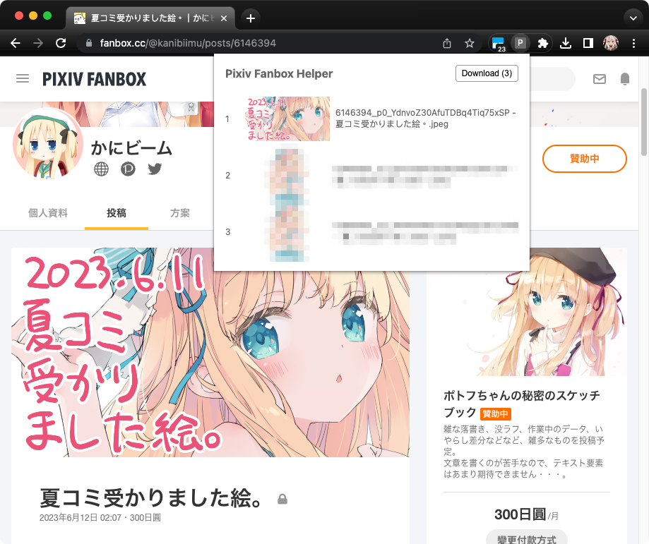
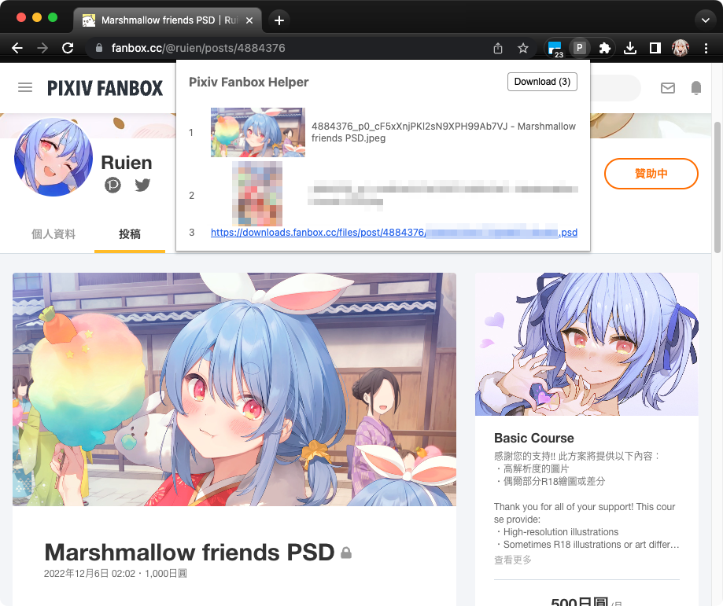
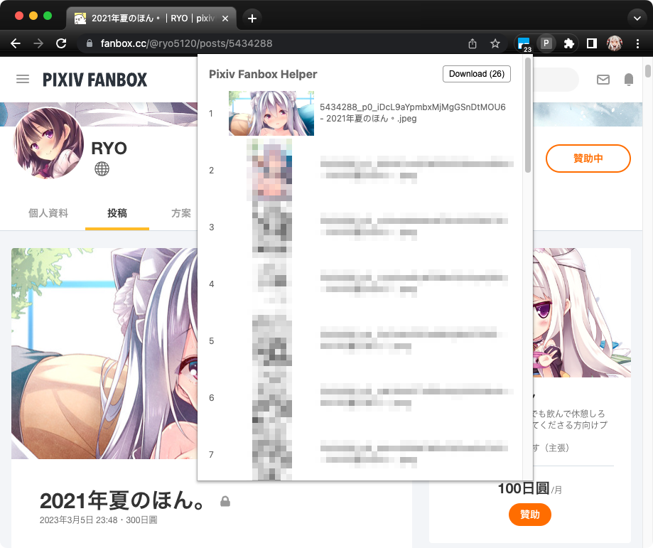

# Pixiv Fanbox Helper

\[中文\]
[\[English\]](README.md)

這是一個 Pixiv Fanbox 的 Chrome 擴充功能。

## 螢幕截圖

<!--  -->

## 功能

這個擴充功能可以幫助你下載 Pixiv Fanbox 目前頁面中的圖片和其他附加檔案。(jpeg, png, gif, zip, psd, etc.)

目前僅有簡單一些簡單功能，但已滿足我的個人需求，近期應該不會再加新功能。

- 列出所有圖片和附加檔案。
- 一鍵下載。
- 點擊圖片能捲動到該圖片的位置。
- 目前下載的檔案名稱，是按照 [PixivUtil2][] 的預設規則來命名。
    (`{postId}_p{index}_{basename} - {title}{ext}`)

### ***重要***

這個擴充功能不會讓你免費下載付費內容。你必須要有有效的訂閱才能下載付費內容。

## 關於

Pixiv Fanbox 是一個創作者發佈作品的平台。

我使用 Fanbox 很長一段時間。隨著時間推移，我陸續訂閱了許多的創作者。但是，每當創作者發佈新內容，我都得手動「右鍵/另存新檔」，這無形中花了我相當多時間。於是我寫了這個 Chrome 擴充功能，方便我保存創作者的作品。

以前我使用 [PixivUtil2][] 來下載 Fanbox，但由於之前 Pixiv 和 Fanbox session_id 機制調整的問題，讓 PixivUtil2 無法正常下載 Fanbox。所以我才寫了這個擴充功能。

## 如何使用

目前，這個擴充功能並沒有上架到 Chrome Web Store。你需要下載這份專案，然後手動安裝擴充功能。

1. 下載這份專案。點擊 GitHub 頁面右上角的「Code」按鈕，然後點擊「Download ZIP」。
2. 解壓縮 ZIP 檔案。
3. 打開 Chrome 瀏覽器，然後在網址列輸入 `chrome://extensions`。
4. 在右上角打開「開發人員模式」。
5. 點擊「載入未封裝項目」，然後選擇剛剛解壓縮的資料夾中的 `extension` 資料夾。
6. 完成。

## How to build

No need to pack, just clone it down, and you can load the unpacked project in
the Chrome browser.

The code of the extension is in the `extension` folder.

## License

這個專案不使用任何授權條款，你可以自由使用這個專案的程式碼。但是，你必須遵守 Pixiv Fanbox 的使用條款。

## 免責聲明

這個專案並非 Pixiv Inc. 或 Pixiv Fanbox 的官方擴充功能。

這個專案不會破解任何具有著作權的內容。

使用者必須遵守 Pixiv Fanbox 的使用條款。

## 更新記錄

在這裡 [CHANGELOG.md](CHANGELOG.md)。

[PixivUtil2]: https://github.com/Nandaka/PixivUtil2
