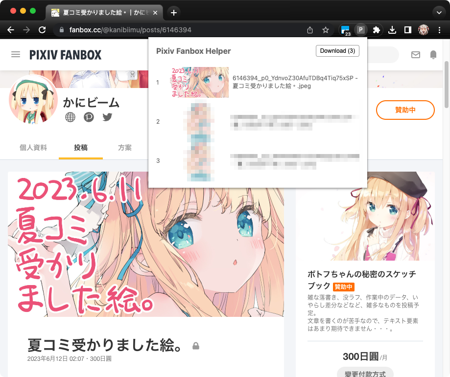
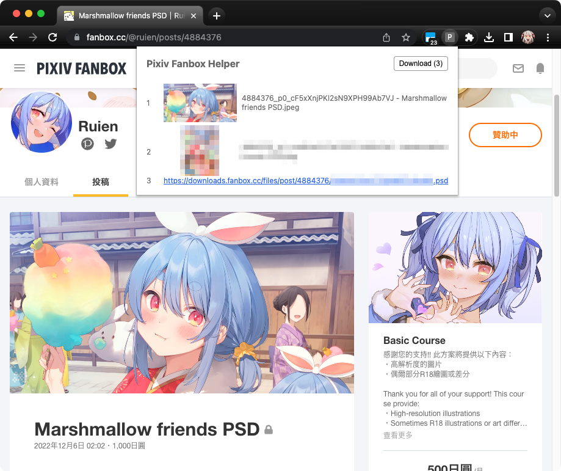
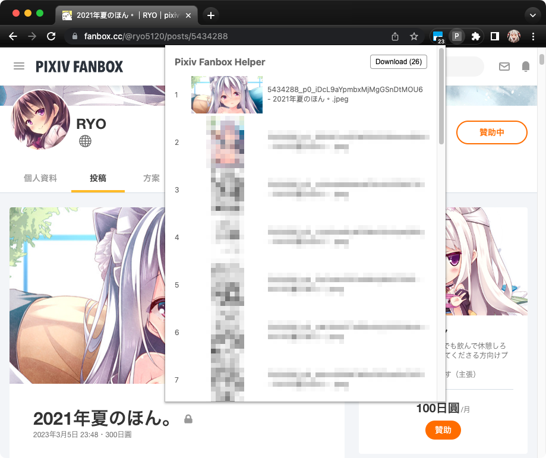

# Pixiv Fanbox Helper

\[English\]
[\[中文\]](README-zh_TW.md)

<!-- 這份文件中的中文註解，是方便我用 Copilot 翻譯英文才留下的 (ﾉ∀`) -->

<!-- Chinese
這是一個 Pixiv Fanbox 的 Chrome 擴充功能。
-->

<!-- English -->
Chrome extension for Pixiv Fanbox.

## Screenshots

<!--  -->

## Features

<!-- Chinese
這個擴充功能可以幫助你下載 Pixiv Fanbox 目前頁面中的圖片和其他附加檔案。
(jpeg, png, gif, zip, psd, etc.)

目前僅有簡單一些簡單功能，但已滿足我的個人需求，近期應該不會再加新功能。

- 列出所有圖片和附加檔案。
- 一鍵下載。
- 點擊圖片能捲動到該圖片的位置。
- 目前下載的檔案名稱，是按照 [PixivUtil2][] 的預設規則來命名。
    (`{postId}_p{index}_{basename} - {title}{ext}`)

### ***重要***

這個擴充功能不會讓你免費下載付費內容。你必須要有有效的訂閱才能下載付費內容。
-->

<!-- English -->
This extension can help you download the images and other attachments on the
current page of Pixiv Fanbox. (jpeg, png, gif, zip, psd, etc.)

Currently, there are only some simple functions, but they have met my personal
needs, and there should be no more functions in the near future.

- List all images and attachments.
- One-click download.
- Click on the image to scroll to the position of the image.
- The file name currently downloaded is named according to the default rules of
    [PixivUtil2][].
    (`{postId}_p{index}_{basename} - {title}{ext}`)

### ***Important***

This extension will not allow you to download paid content for free. You must
have a valid subscription to download paid content.

## About

<!-- Chinese
Pixiv Fanbox 是一個創作者發佈作品的平台。

我使用 Fanbox 很長一段時間。隨著時間推移，我陸續訂閱了許多的創作者。但是，每當創
作者發佈新內容，我都得手動「右鍵/另存新檔」，這無形中花了我相當多時間。於是我寫了
這個 Chrome 擴充功能，方便我保存創作者的作品。

以前我使用 [PixivUtil2][] 來下載 Fanbox，但由於之前 Pixiv 和 Fanbox session_id
機制調整的問題，讓 PixivUtil2 無法正常下載 Fanbox。所以我才寫了這個擴充功能。
-->

<!-- English -->
Pixiv Fanbox is a platform for creators to publish their works.

I have been using Fanbox for a long time. Over time, I have subscribed to many
creators one after another. However, whenever the creator publishes new content,
I have to manually "right-click / save as", which invisibly takes me a lot of
time. So I wrote this Chrome extension to save the creator's work.

I used [PixivUtil2][] to download Fanbox before, but due to the problem that
the session_id mechanism of Pixiv and Fanbox was adjusted before, PixivUtil2
cannot download Fanbox normally. So I wrote this extension.

## How to use

<!-- Chinese
目前，這個擴充功能並沒有上架到 Chrome Web Store。你需要下載這份專案，然後手動安裝
擴充功能。

1. 下載這份專案。點擊 GitHub 頁面右上角的「Code」按鈕，然後點擊「Download ZIP」。
2. 解壓縮 ZIP 檔案。
3. 打開 Chrome 瀏覽器，然後在網址列輸入 `chrome://extensions`。
4. 在右上角打開「開發人員模式」。
5. 點擊「載入未封裝項目」，然後選擇剛剛解壓縮的資料夾中的 `extension` 資料夾。
6. 完成。
-->

<!-- English -->
Currently, this extension is not available on the Chrome Web Store. You need to
download this project and install the extension manually.

1. Download this project. Click the "Code" button in the upper right corner of
    the GitHub page, and then click "Download ZIP".
2. Unzip the ZIP file.
3. Open the Chrome browser and enter `chrome://extensions` in the address bar.
4. Open "Developer mode" in the upper right corner.
5. Click "Load unpacked" and select the `extension` folder in the folder just
    unzipped.
6. Done.

## How to build

<!-- Chinese
不需要打包，直接 clone 下來後，就可以在 Chrome 瀏覽器中載入未封裝項目。

擴充功能的程式碼在 `extension` 資料夾中。
-->

<!-- English -->
No need to pack, just clone it down, and you can load the unpacked project in
the Chrome browser.

The code of the extension is in the `extension` folder.

## License

<!-- Chinese
這個專案不使用任何授權條款，你可以自由使用這個專案的程式碼。但是，你必須遵守 Pixiv
Fanbox 的使用條款。
-->

<!-- English -->
This project does not use any license terms, you can use the code of this
project freely. However, you must comply with the terms of use of Pixiv Fanbox.

## Disclaimer

<!-- Chinese
這個專案並非 Pixiv Inc. 或 Pixiv Fanbox 的官方擴充功能。

這個專案不會破解任何具有著作權的內容。

使用者必須遵守 Pixiv Fanbox 的使用條款。
-->

<!-- English -->
This project is not an official extension of Pixiv Inc. or Pixiv Fanbox.

This project will not crack any copyrighted content.

Users must comply with the terms of use of Pixiv Fanbox.

## Changelog

See [CHANGELOG.md](CHANGELOG.md).

[PixivUtil2]: https://github.com/Nandaka/PixivUtil2
